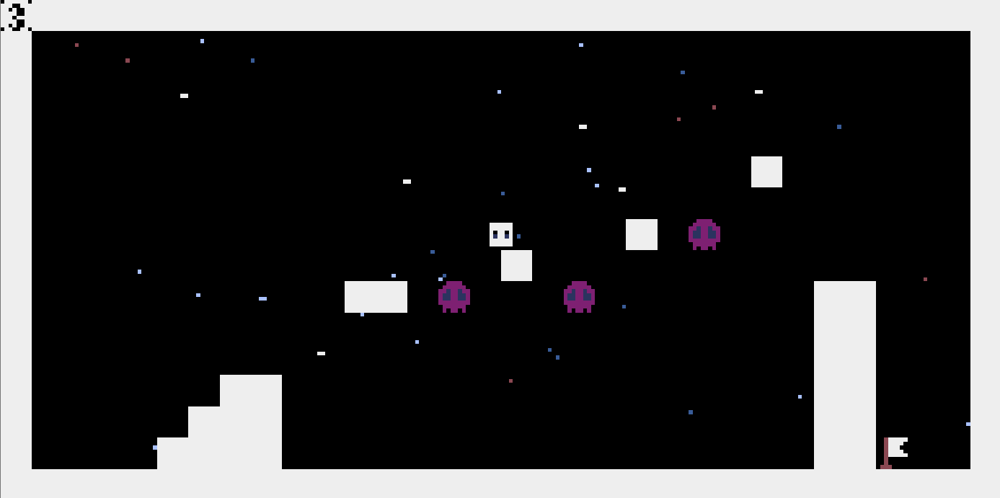

# 🎨 THE COLORS

色に応じて能力が変化するキャラクターを操作して、ゴールの旗を目指す謎解き系アクションゲームです。  
フィールドに配置された **色付きオーブ** を取るとキャラクターの色が変化し、それぞれ固有の能力を得ます。  
基本状態は **白色** です。

## 🎬 タイトル画面

---

## 🟦 色と能力

- **赤**：赤いブロックの上に乗れる（壁としても作用する）  
- **青**：青いブロックを泳げる  
- **黄**：黄色のブロックの上に乗れる  
  - ジャンプ力が少し上昇  
  - 2段ジャンプ可能  
- **緑**：緑のブロックの上に乗れる  
  - 緑のブロックの下にくっついて移動可能  
  - くっついた状態でジャンプすると降りられる  
- **紫**：特殊ルール  
  - 通常は紫ブロックに乗れるが、自身が紫の時は乗れない  
  - 紫の時は他の色のブロックが壁になる  
- **橙**：上キー入力で頭上に橙ブロックを生成（1つのみ設置可能）  
  - 橙ブロックは他の色でも乗れる  
- **灰**：下キー入力で周囲（上下左右）の岩ブロックを破壊できる  
  - 岩ブロックはどの色でも乗れる  
- **黒**：重力がなくなる  
  - ジャンプ不可  
  - 上下左右キーで自由移動可能  
  - すべての色のブロックが壁になる  

### 🗂 ステージ選択画面

### 🕹 プレイ画面

---

## ⌨️ 操作方法

- **スペースキー**：ジャンプ  
- **R**：リトライ（挑戦中ステージをリセット）  
- **Q**：  
  - ステージ挑戦中 → ステージ選択画面に戻る  
  - ステージ選択画面 → タイトル画面に戻る  
- ゲームコントローラーやスマホ操作にも対応  
  - スマホ・コントローラーの操作方法はタイトル画面の「操作方法」を参照  

### 📖 操作方法画面

---

## 💾 セーブについて（Web版）

- セーブデータは 1 つのみ  
- 保存データは **ブラウザのキャッシュ** で管理  
